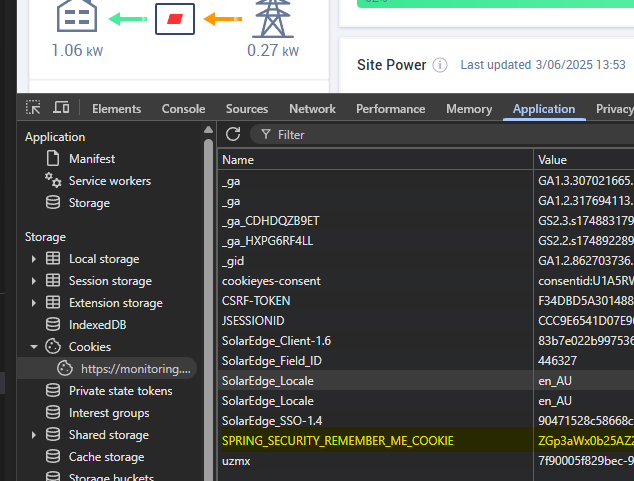

## about 

This code will download all of your data from SolarEdge's monitoring API. It is designed to allow you to consider a battery system based on your historical data.

## SolarEdge API Authentication Cookie
To get the cookie value from monitoring.solaredge.com/solaredge-web/p/home, follow these steps:

Open the Website
In your terminal, run:

Log In
Log in with your SolarEdge credentials if prompted.

Open Developer Tools
Press F12 or right-click anywhere on the page and select Inspect to open your browser's Developer Tools.

Go to the Application/Storage Tab

In Chrome/Edge: Click the Application tab.
In Firefox: Click the Storage tab.
Find Cookies
In the left sidebar, expand Cookies and select monitoring.solaredge.com.

Copy the Cookie Value

Add it to a file named secret.py

```python
cookie="cookie_value_here"
```




## Running
To run the script, ensure you have Python installed and the required libraries. You can install the necessary libraries using pip:

```bash
pip install -r requirements.txt
```

Then, run the script:

```bash
python solar_energy_download.py
```

This may take some time, but don't remove the delay as you may get blocked by the API if you make too many requests in a short time.

Open solar_with_bat.py and set the variables, particulartily cents_per_kWh. You have the option to conisder a larger system, this is simplistic but gives you an idea.

```bash
python solar_with_bat.py
```